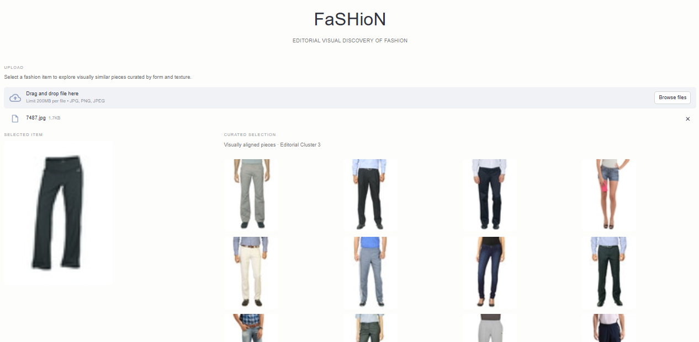

# 👗 FaSHioN  
**Editorial-Grade Fashion Image Clustering & Visual Discovery**

FaSHioN is an **unsupervised fashion image clustering pipeline** designed to organize, explore, and discover visual patterns in fashion imagery at an editorial and catalog scale. By leveraging **deep visual embeddings** and **classical machine learning**, FaSHioN enables automated grouping of fashion images based purely on visual similarity—without labels.

Live Demo: https://fashion-clustering.streamlit.app/

---

## ✨ Key Features

- **Deep Visual Understanding** using pre-trained **ResNet50**
- **Unsupervised Clustering** with **K-Means**
- **Dimensionality Reduction** via **PCA**
- **Editorial-grade visual discovery** for trend analysis, styling, and catalog curation

---

## 🧠 How It Works

1. **Feature Extraction**  
   Images are passed through a pre-trained **ResNet50** (ImageNet) to extract high-level visual embeddings.
2. **Dimensionality Reduction**  
   High-dimensional embeddings are compressed using **Principal Component Analysis (PCA)** to improve clustering efficiency and separability.
3. **Clustering**  
   **K-Means** groups images into visually coherent clusters representing styles and silhouettes.
4. **Visual Exploration**  
   Clustered outputs can be used for visual inspection, similarity search, or downstream fashion analytics.

---

## 📦 Tech Stack

- **Python**
- **TensorFlow / Keras** – ResNet50
- **Scikit-learn** – PCA & K-Means
- **NumPy / Pandas**
- **Matplotlib / Seaborn** (optional visualization)

## 🔮 Future Enhancements

- Color-aware clustering
- Use self-supervised vision models (CLIP, DINO)
